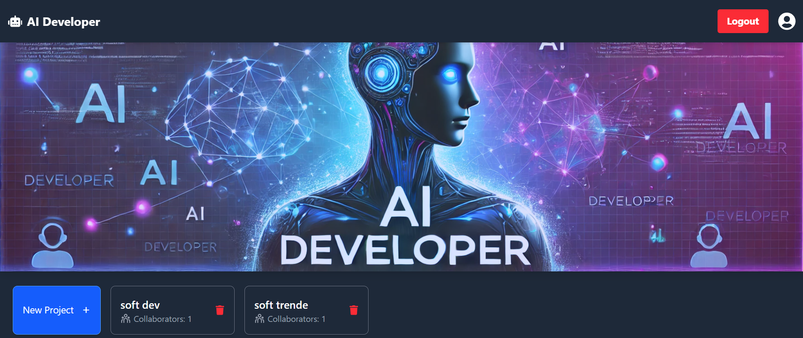
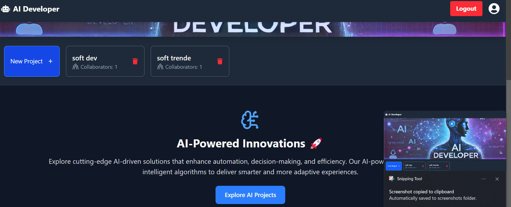
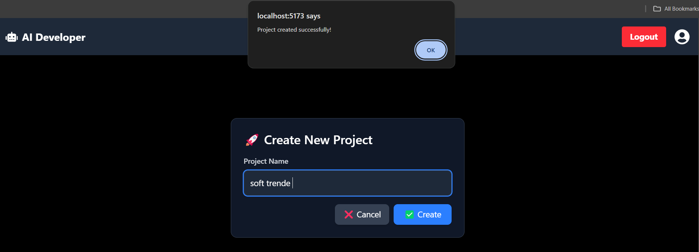
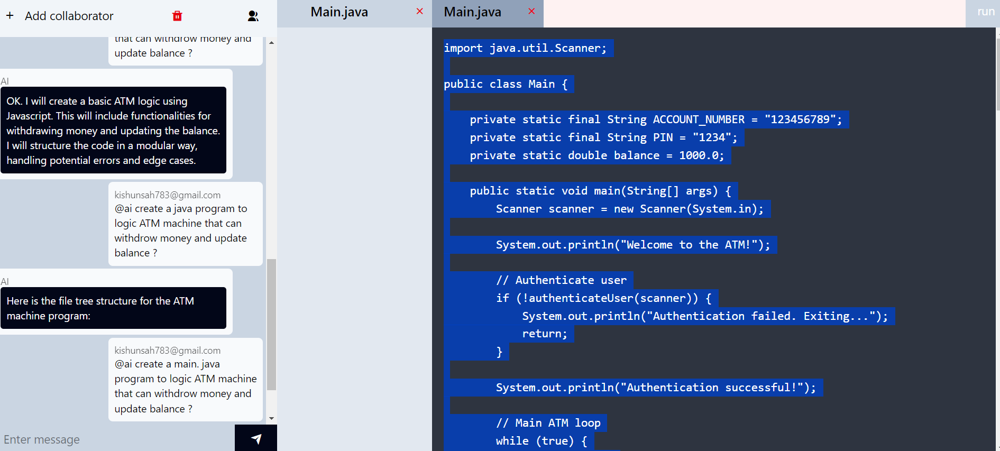
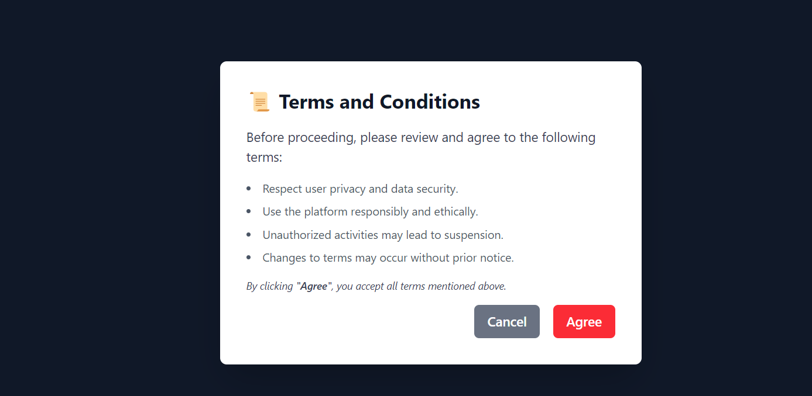

# AI Developer Powered by Chat App or Gemini

## Overview
This application is designed to assist developers by leveraging AI-powered tools to enhance productivity and streamline project management. It includes features such as project creation, user management, and collaboration tools, also chat with AI and Collabration team , editor .

## Features
- Create and manage projects.
- Add and manage users in projects.
- Retrieve project details and user-specific projects.
- Delete projects.
- Private chat with all collaborative team 
- chat with AI 
- Editor support that can support you code edit .
- 10 year MERN experience  stack developer AI Support virtual.

## Technologies Used
- **Backend**: Node.js, Express.js
- **Database**: MongoDB (Mongoose ODM)
- **AI Integration**: OpenAI API (or similar AI services)
- **Frontend**: React.js (if applicable)
- **Authentication**: JSON Web Tokens (JWT)
- **Other Tools**: 
  - ESLint for code linting.
  - Prettier for code formatting.
  - Git for version control.

## Example Output
Below is an example of the application interface or output:


<br>



<br>



<br>



<br>



<br>



> Note: Replace `./assets/example-output.png` with the actual path to your output image.

## Setup Instructions
1. Clone the repository:
   ```bash
   git clone https://github.com/kisun-sah/AI-Developer-Power-by-Chat-app-or-developer-
   ```
2. Install dependencies:
   ```bash
   npm install
   ```
3. Configure environment variables in a `.env` file:
   - `MONGO_URI`: MongoDB connection string.
   - `JWT_SECRET`: Secret key for JWT.
   - `OPENAI_API_KEY`: API key for AI integration.
4. Start the application:
   ```bash
   npm start
   ```

## Contributing
Feel free to contribute to this project by submitting issues or pull requests.

## License
This project is licensed under the MIT License.